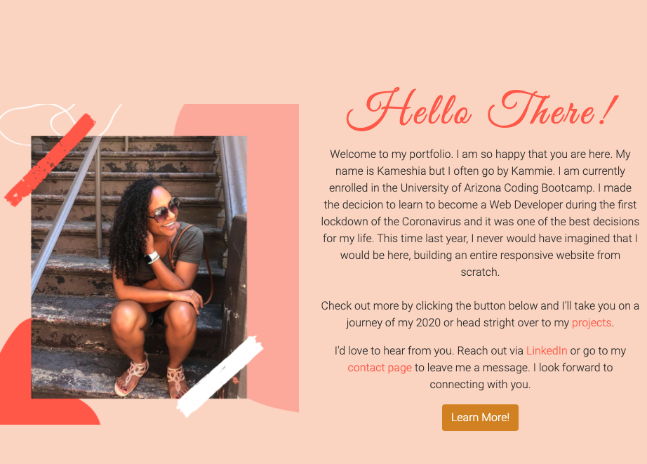
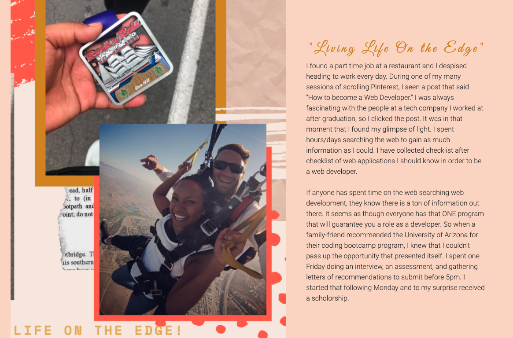

# Kameshia's Portfolio

## Description

In this project, I created a simple portfolio to display the projects that I have done throughout the University of Arizona Bootcamp. For this project, I used mainly Bootstrap to develop the container, rows, and columns. Our assignment was to use the CSS framework to quickly style and develop a web application. 

I found working with Bootstrap to be beneficial because it cut down on the time to make media queries. I spent less time working on floats and more time on adding my own personal touches to the portfolio. I wanted to make something that showed more than just my portfolio but also focused on my unique and creative style. So I took the time to capture my brand, my personality, and creative style. 

This repository will be updated as projects roll in. Stay tuned to the continual development of my portfolio. Check it out for yourself. 

This site was built using [GitHub Pages](https://kammielatay.github.io/Portfolio/)